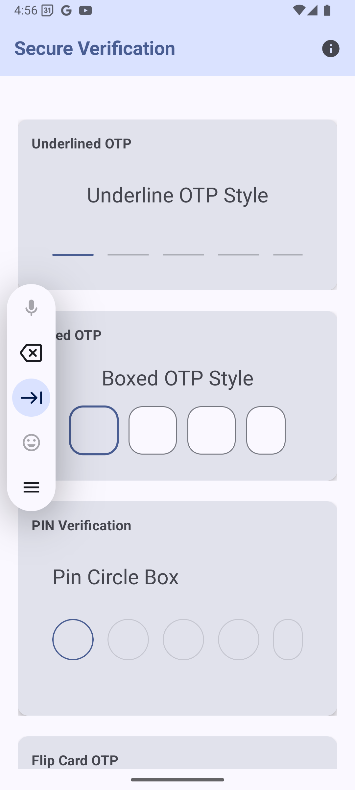
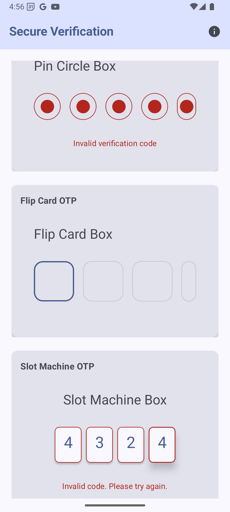

# OTP Box

A beautiful and animated Android OTP input UI library built with Jetpack Compose, featuring multiple modern input styles with smooth animations.

<p align="center">
  
  
</p>


## Features

### Multiple OTP Input Styles
- 📝 Underlined OTP Input
- 🎯 Boxed OTP Input
- 🔄 Flip Card Animation
- 🎰 Slot Machine Animation
- ⭕ PIN Circle Input

### Animation Features
- ✨ Smooth focus transitions
- 🎭 Flip card animations
- 🎡 Slot machine-style digit reveals
- 🌊 Wave-like underline animations
- 🔄 Real-time input feedback
- 🎨 Material Design 3 animations

### UI Components
- 🎨 Material Design 3 components
- 📱 Responsive layouts
- 🎯 Interactive focus states
- ⚡ Real-time validation feedback
- 🎭 Beautiful transitions

## Technical Details

- Built with Jetpack Compose
- Minimum SDK: Android 6.0 (API level 23)
- Target SDK: Latest Android version
- Architecture: MVVM (Model-View-ViewModel)
- Uses Material Design 3 components
- Implements modern Compose animations

## Getting Started

### Prerequisites

- Android Studio Arctic Fox or newer
- JDK 11 or newer
- Android SDK with minimum API level 23

### Installation

1. Clone the repository:
```bash
git clone https://github.com/SatyamkrJha85/OTP_BOX
```

2. Open the project in Android Studio

3. Sync the project with Gradle files

4. Build and run the application

## Usage Examples

### Underlined OTP
```kotlin
UnderlineAnimatedOtpBox(
    otpText = otpText,
    otpCount = 6,
    onOtpTextChange = { newText -> otpText = newText },
    cellWidth = 48,
    isError = false
)
```

### Boxed OTP
```kotlin
RoundedBoxAnimatedOtp(
    otpText = otpText,
    otpCount = 4,
    onOtpTextChange = { newText -> otpText = newText },
    isError = false
)
```

### Flip Card OTP
```kotlin
FlipCardAnimatedOtp(
    otpText = otpText,
    otpCount = 4,
    onOtpTextChange = { newText -> otpText = newText },
    isError = false
)
```

### Slot Machine OTP
```kotlin
SlotMachineOtp(
    otpText = otpText,
    otpCount = 4,
    onOtpTextChange = { newText -> otpText = newText },
    isError = false
)
```

### PIN Circle OTP
```kotlin
PinCircleAnimatedOtp(
    otpText = otpText,
    otpCount = 6,
    onOtpTextChange = { newText -> otpText = newText },
    isError = false
)
```

## Features in Detail

### Animation System
- Spring-based animations for natural movement
- Smooth transitions between states
- Custom animation curves for different effects
- Real-time feedback animations

### UI Components
- Material Design 3 color scheme
- Dynamic color support for Android 12+
- Custom typography system
- Responsive layouts for all screen sizes

### Input Handling
- Automatic focus management
- Keyboard type optimization
- Error state handling
- Real-time validation

## Contributing

Contributions are welcome! Please feel free to submit a Pull Request.

## License

This project is licensed under the MIT License - see the LICENSE file for details.

## Acknowledgments

- Material Design 3 for the beautiful UI components
- Jetpack Compose for the modern UI toolkit
- The Android community for their continuous support

## Contact

For any queries or support, please open an issue in the repository.

---

Made with ❤️ for beautiful OTP inputs 
